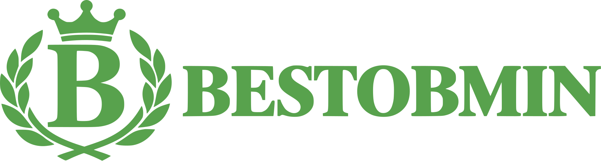

# BEST — обмін валют в Івано-Франківську

Односторінковий сайт мережі обмінних пунктів. Темна мінімалістична тема,
акцентний колір — зелений (похідний від `#58A24D`).

## Запуск

```bash
node serve.mjs   # http://localhost:4199
```

## Структура файлів

| Файл | Призначення |
|---|---|
| `index.html` | Готовий сайт — один самодостатній файл (HTML + CSS + JS) |
| `parts/` | Вихідні фрагменти, з яких збирається `index.html` |
| `assemble.mjs` | Збирає `parts/*` → `index.html` (`node assemble.mjs`) |
| `images/` | Усі зображення сайту |
| `images/hero-globe.png` | 3D-візуалізація на першому екрані |
| `images/logo.svg` | Логотип у шапці та футері |
| `images/favicon.svg` | Фавікон — знак із логотипа (корона, «B», лавр) |
| `media/` | Відео першого екрана: `hero.mp4` (2,1 МБ) + постер `hero-poster.jpg` |
| `serve.mjs` | Локальний сервер для перегляду |

Редагувати можна або напряму `index.html`, або файли в `parts/` з наступним
`node assemble.mjs`.

## Що потрібно замінити перед публікацією

1. **Telegram.** Посилання `https://t.me/best_obmin` — заглушка (4 місця:
   шапка, блок заявки, картка «Контакти», футер). Підставте реальний акаунт/бот.
2. **Курси валют.** Значення взяті з брифу на 13.09 і зашиті у двох місцях:
   - розмітка таблиці та карток (секція `#rates`, файл `parts/body-02.html`);
   - об'єкт `RATES` у JS (`parts/zz-tail.html`) — для калькулятора.
   Для щоденного оновлення варто підключити їх з одного джерела (API або JSON).
3. **Фіксація курсу — 30 хвилин.** Тривалість вказана у 5 місцях
   (hero, чеклист заявки, блок підсумку, крок 02, og:description).
   Курс USD у калькуляторі автоматично перемикається між оптовим
   (від 400 у.о.) та роздрібним — `RATES` і `RATES_RETAIL` у скрипті.
4. **Форми.** `exchangeForm` і `callbackForm` зараз лише показують повідомлення
   про успіх — підключіть відправку на пошту / у Telegram / у CRM.
5. **Новини** — три демонстраційні матеріали без окремих сторінок.
6. **Відгуки** — тексти й портрети згенеровані як приклад.

## Реальні дані з брифу (вже на сайті)

- Назва: **BEST — обмін валют**. Логотип — монограма «B.» у зеленому,
  словесний знак латиницею + підпис «ОБМІН ВАЛЮТ» українською.
- Три відділення: Чорновола 4, Лепкого 14, Вовчинецька 190 — адреси, телефони
  та графіки роботи відповідають брифу.
- Послуги: обмін з доставкою, пошкоджені банкноти, обмін монет.
- Додатково: лазерне гравіювання клавіатур і MacBook.
- Примітка про оптовий курс від 400 у.о.
- Курси всіх валют зі списку, включно з USDT і крос-курсом EUR/USD.

## Перший екран

Три колонки, як у референсі: текст ліворуч, 3D-глобус по центру,
панель актуальних курсів праворуч.

- **3D-візуалізація** — `images/hero-globe.png`. Чорний фон вирізано
  (`mix-blend-mode: screen`), тому об'єкт «лежить» просто на фоні без рамки.
  Легке погойдування вимикається при `prefers-reduced-motion`.
- **Панель курсів** — дві вкладки: «Популярні» (5 основних валют) та
  «Всі валюти» (всі 12). Дані ті самі, що й у секції `#rates`.
- Від 1180px і нижче глобус ховається за колонки як фонова деталь,
  від 900px — стає окремим блоком зверху.

## Відео у першому екрані

Фон героя — зациклене відео лічильної машинки (`media/hero.mp4`, 1920×1080,
16 с, без звуку, 2,1 МБ). Відтворюється автоматично, `muted` + `playsinline`,
щоб працювало на iOS. Поки відео вантажиться, показується `hero-poster.jpg`.
Після додавання 3D-глобуса відео приглушене (`opacity .34`) — воно лишається
фактурою, а не головним елементом.

Для читабельності тексту накладено три шари: приглушення самого відео
(`opacity .92`, `brightness .8`), затемнення-віньєтка під блоком тексту та
зелене світіння знизу. Кнопка «Переглянути курси» має власне розмите
підкладення. Заміряний контраст у найсвітліший момент циклу: заголовок
13,2:1, підзаголовок 9,5:1, кнопка 11,9:1 — усе вище за WCAG AAA (7:1).

При `prefers-reduced-motion: reduce` відео не програється — показується постер.

**Перекодування** (якщо заміните вихідне відео):

```bash
ffmpeg -i video.mov -an -vf "scale=1920:1080:flags=lanczos,\
eq=brightness=-0.05:saturation=0.72:contrast=1.05,\
colorbalance=bs=-0.08:gm=0.06:gh=0.03,format=yuv420p" \
  -c:v libx264 -preset slow -crf 28 -g 50 -movflags +faststart media/hero.mp4
```

> `video.mov` (1,5 ГБ, ProRes 4K) — вихідний майстер-файл. На сервер його
> завантажувати не потрібно, достатньо `media/`.

## Логотип

Логотип підключено як звичайне зображення:

```html

```

Щоб замінити логотип, достатньо покласти новий файл замість `images/logo.svg` —
правити HTML не потрібно. Висота задається в CSS (`.logo__img`), ширина
підлаштовується сама: 44px на десктопі, 34px на мобільних.

`images/favicon.svg` зібрано з того ж контуру — узято лише знак (без напису)
і поміщено на темну плитку зі скругленням.

> У логотипі напис **BESTOBMIN**, тоді як у текстах сайту (title, meta,
> мікророзмітка, футер) назва — **BEST**. Якщо треба звести до одного варіанту,
> скажіть, і я оновлю текстові згадки.

## Прапори валют

Прапори — власний SVG-спрайт (`parts/body-00.html`, ~9 КБ), вбудований у
сторінку: жодних зовнішніх запитів, іконкових шрифтів чи emoji. 12 символів —
USD, EUR, GBP, PLN, CHF, CAD, CZK, SEK, HUF, UAH, USDT і комбінований значок
для крос-курсу EUR/USD (половина ЄС + половина США).

Кожен бейдж підставляється через `<use href="#fl-…">`, тож один і той самий
прапор не дублюється в коді. Щоб додати валюту — додайте `<symbol>` у спрайт
і вставте бейдж:

```html
<span class="cur-badge">
  <svg class="flag" role="img" aria-label="Назва валюти"><use href="#fl-код"/></svg>
</span>
```

## Адаптивність

Перевірено на 19 ширинах від 320px до 1920px: без горизонтального скролу,
без накладань, без обрізаного тексту.

Мінімальні розміри, закладені у верстку:
- **жодного тексту менше 14px** на всьому сайті (15px на мобільних);
  основний текст — 17px, текст у картках — 16px;
- зони натискання — не менше 44px по висоті на екранах до 900px;
- вміст не обрізається: назви валют переносяться, а не ховаються за «…».

## Палітра

Акцент — золотий градієнт **#FBDBA2 → #CCA377 → #FBDBA2**.
Усі відтінки заведені у токени в `parts/css-00.css`:

```css
--accent-200:#fbdba2;   /* світлий стоп */
--accent-600:#cca377;   /* середній стоп, основний інтерактив */
--accent-700:#a8835c;   /* глибокий — лише для рамок, не для тексту */
--accent-grad:linear-gradient(115deg,#fbdba2 0%,#cca377 48%,#fbdba2 100%);
--on-accent:#1a1206;    /* підпис на будь-якій градієнтній заливці */
```

Сам градієнт застосовано там, де він працює як метал: виділене слово в
заголовку, великі цифри-показники, головні кнопки, логотип і фавікон.
Решта — суцільні стопи з тієї ж шкали.

Зелене підсвічування у 3D-рендерах перефарбовано у золото: зсунуто лише
зелений діапазон відтінків, тож банкноти, шкіра й теплий метал на фото
зберегли власний колір. Оригінали рендерів не потрібні для роботи сайту.

> Зеленими лишились рівно два кольори — і мають лишитись: смуга на
> прапорі Угорщини (`#477050`) та фірмовий знак Tether (`#26A17B`).

## Колір тексту та контраст

Увесь текст білий (`--text`, `--text-2`, `--text-3`, `--text-4` = `#ffffff`).
Акцентний колір використовується **тільки як акцент, не як колір для читання**:

| Де | Що |
|---|---|
| `.accent` | виділене слово в заголовку |
| `.ben__num`, `.field__v`, `.route__rate b` | великі цифри-показники |
| `.step__n` | номери кроків 01–03 |
| `.logo__text b` | назва бренду |
| `.delta.up` / `.delta.down` | зростання / падіння курсу |

Темний текст залишено лише на світлих кнопках (білий був би невидимий).

Контраст кожного кольору тексту заміряно відносно реального фону під ним.
Найгірший показник на сайті — **8,0:1** (WCAG AAA вимагає 7:1):
темний підпис на найтемнішому стопі градієнта.

## Технічні деталі

- Шрифти: Inter Tight (заголовки), Inter (текст), JetBrains Mono (цифри, мітки).
- Прапори валют: вбудований SVG-спрайт (27 бейджів, 12 унікальних прапорів).
- Зображення: `images/*.jpg`, згенеровані `gemini-3-pro-image-preview`.
- Карта: вбудований Google Maps з CSS-фільтром під темну тему,
  перемикається вкладками між трьома відділеннями.
- Мікророзмітка `schema.org/CurrencyConversionService` з трьома локаціями BEST.
- Адаптив від 375px; перевірено на 1440 / 1200 / 1024 / 768 / 480 / 375 —
  без горизонтального скролу.
- Підтримка `prefers-reduced-motion` (у т.ч. зупинка фонового відео).

> `node_modules` — символічне посилання на сусідній проєкт (puppeteer для
> скріншотів). Для окремого розгортання достатньо `index.html` та `images/`.
